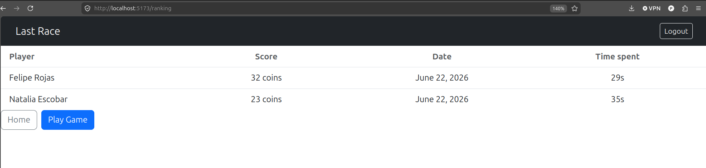
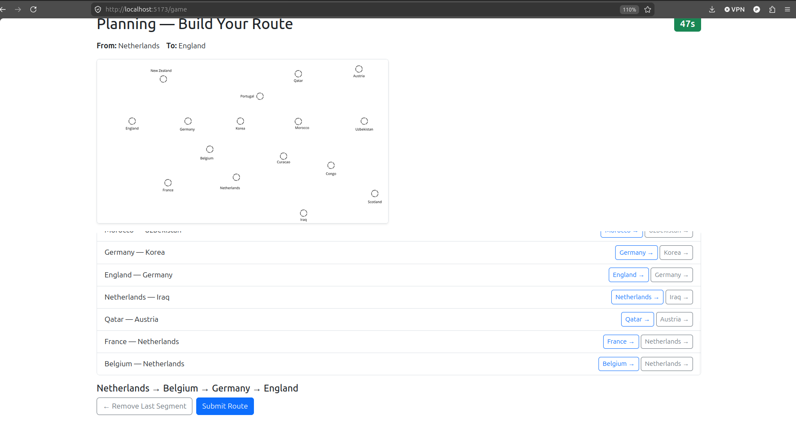

# Exam #1: "Last Race"

## Student: s352323 ROJAS DIAZ FELIPE

## React Client Application Routes

- Route `/`: This one is the "Home" of the web app, is where everything starts. From here the user can choose to login or see the rules of the game. Is also the route where the user  arrive after he/she logged in.
- Route `/login`: This route shows 2 fill-form boxes to write the mail and password so the user can login, and the button to make the action.
- Route `/ranking`: This route has the ranking of the game. It shows a table with the best score from each user, date of that score and the time spent he/she spent solving the game.
- Route `/rules`: This route take the user to the general rules of the game. Inside of it, shows the rules of the game and 2 buttons. One for going back to the home route of one to login if the user wants to login. If the user is already logged in, the button will show the "Let's play" message instead of login.
- Route `/game`: This route contains all the game, since the setup phase to the results phase. It shows phase by phase, one by one everytime the user is advancing through the game. Everyitme the user call it, it takes us to the setup phase of the game

## API Server

- POST `/api/sessions` — Login

  - Request body: `{ username: string (email), password: string }`
  - Response body: `{ id, name, surname, username }` — the authenticated user
- GET `/api/sessions/current` — Check current session

  - Request parameters: none
  - Response body: `{ id, name, surname, username }` or `401 { error: "Not authenticated" }`
- DELETE `/api/sessions/current` — Logout

  - Request parameters: none
  - Response body: empty
- GET `/api/segments` — List all network segments in random order, used during planning phase

  - Request parameters: none
  - Response body: `[ { station1: string, station2: string }, … ]`
- GET `/api/network` — Full network graph with line information, used to build the station-ID map on the client

  - Request parameters: none
  - Response body: `[ { lineId, lineName, station1Id, station1Name, station1IsInterchange, station2Id, station2Name, station2IsInterchange }, … ]`
- POST `/api/games` — Create a new game; the server picks a random start and end station at least 3 stops apart

  - Request body: none
  - Response body: `{ id, startStationId, endStationId }`
- POST `/api/games/:id/validate` — Planning-phase check: verifies ownership, game status, and that the submitted start/end IDs station match the assigned ones

  - Request parameters: `id` (integer, game ID in the URL)
  - Request body: `{ startId: number, endId: number }`
  - Response body: `{ valid: true }` or error (`400` / `403` / `404` / `422`)
- POST `/api/games/:id/route` — Execution phase: validates each segment against the network, checks line changes only at interchange stations, applies a random weighted event per segment, maintains the result and returns the final score

  - Request parameters: `id` (integer, game ID in the URL)
  - Request body: `{ segments: [ { fromId: number, toId: number, lineId: number } ], timeSpent: number }`
  - Response body: `{ finalCoins: number, segments: [ { fromStationId, toStationId, lineId, coinDelta, eventName } ] }`
- GET `/api/ranking` — Best score per user.

  - Request parameters: none
  - Response body: `[ { name, surname, final_coins, time_spent, created_at }, … ]`

## Database Tables

- Table `users` - Contains the ID, surname, name and email from each user. Besides, the hash password for each one and the salt to ensure the hash result is unique to each password.
- Table `stations` - Contains the ID of each station, the name and a boolean value that says if it's an interchange station or not
- Table `lines` - Contains the ID of the line, the line name and amount of stations which is mainly informative
- Table `connections` - This one is maybe the most important because it contains all the possible connections available in the network, referencing the line id, and the stations id in 2 columns. Station 1 and Station 2
- Table `events` - Contains the ID, name and score of the events. I added a probability of getting the event to make it look more "random" the selecting of events.
- Table `segments` - Contains the information of each completed and correct game in a detailed way. Shows the segments the user chose, the order of them, the gameId to make the discrimination by games, and the delta of coins in each segment based on the randomly selected events
- Table `games` - Contains the information of every game tried, discriminated by a game ID, the information of the user that played that game, which were the initial and end stations chosen by the server, the final score (coins). And I added 2 columns just for extra information about when was the game played and the time the user spent submitting a solution of the game.

## Main React Components

- `Header` (in `Header.jsx`): Header bar present on every page. Shows the app title, as a link to home, and a "Logout" button when the user is authenticated.
- `LoginForm` (in `LoginLayout.jsx`): Email and password form that calls the login handler passed as prop. On success it redirects to `/`; on failure it shows an inline error alert.
- `InitLayout` (in `PageLayout.jsx`): Home page. Shows two columns with buttons — one with login or play/ranking depending on the authentication state, the other one with a button that links to the rules.
- `RulesLayout` (in `PageLayout.jsx`): Static page describing the game phases, route rules and scoring. The action button at the bottom adapts to show "Login to Play" or "Let's Play" based on authentication state.
- `GameLayout` (in `GameLayout.jsx`): Main game component that manages the full game lifecycle across the four phases of the game — Setup, Planning, Execution, and Result — each rendered as its own sub-component. This component owns all shared states like data, network, timer, segments and controls the phase transitions.
- `RankingList` (in `DisplayRankings.jsx`): Displays the leaderboard as a table with a header row and one `RankingInList` row per entry. Includes buttons to go home or start a new game.

## Screenshot

## Users Credentials

- s352323@polito.it, 123456
- s150126@polito.it, 123456
- s333333@polito.it, 123456

## Use of AI Tools

I mainly used Claude while working in the project. I use it for validating the logic in the back-end, the choosing of the start and end stations and for validating the segments. Then, while doing the front-end I use it with React Bootstrap syntaxis because it's actually kind of complicated and not very clear.  For verifying the output I made 2 things: First read the code that Claude help me do it, and if I consider it was doing the wrong stuff I reformulate or corrected my self. The second thing I did, if I thought the code was correct and saw some small details I didn't liked when rendering the page I asked for some help to change that small details (Text size, colors, appearence).
